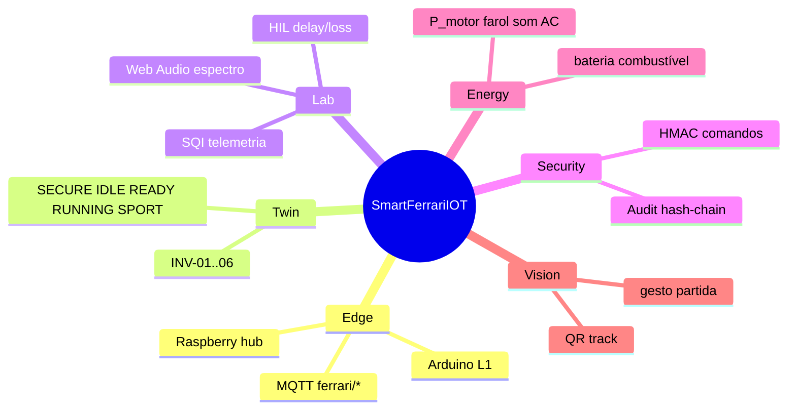
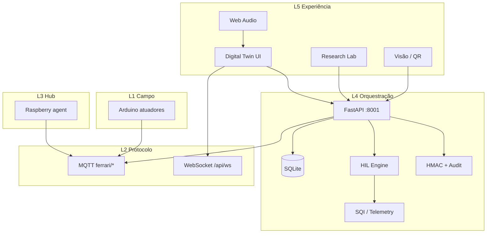
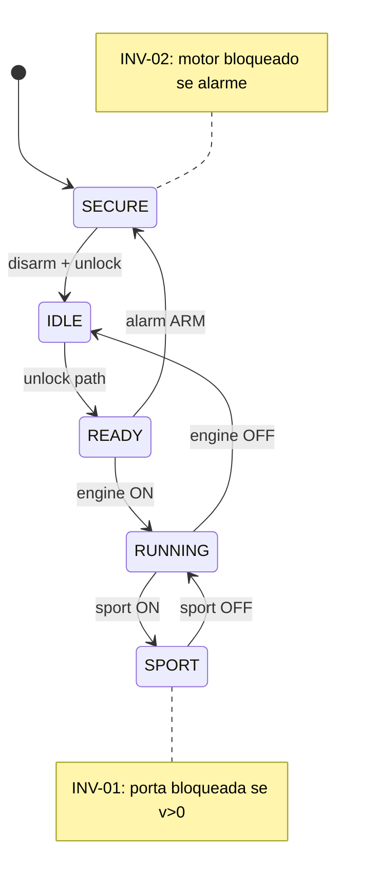
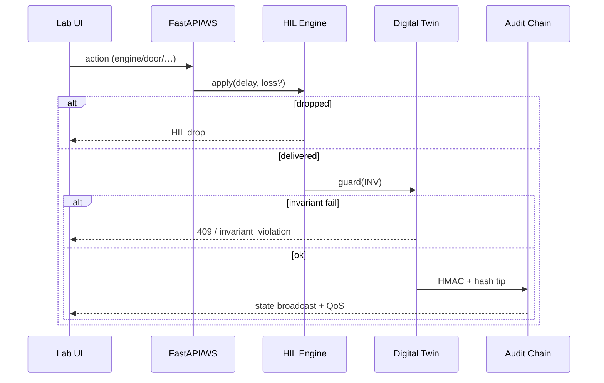

# SmartFerrariIOT

> Plataforma experimental de **pós-doutorado** para sincronização edge **Arduino ↔ Raspberry Pi**, gêmeo digital formal, HIL/QoS, Web Audio e Research Lab aplicados a um veículo Ferrari (SF90 lab unit).

<p align="center">
  <a href="http://127.0.0.1:8001"></a>
  
  
</p>

---

## Interface do Laboratório (análise / defesa)

> [!IMPORTANT]
> **Abra a interface local neste endereço (bem visível para análise):**
>
> # Ferrari http://127.0.0.1:8001
>
> Login padrão: `admin` / `ferrari123`  
> Porta **8001** (SmartHomeIOT usa **8000** — podem coexistir).

```powershell
cd SmartFerrariIOT   # ou FerrariArduínoProject
.\start.ps1
```

Depois abra no browser:

| Recurso | URL |
|---------|-----|
| **UI Lab (principal)** | **http://127.0.0.1:8001** |
| Health | http://127.0.0.1:8001/health |
| OpenAPI | http://127.0.0.1:8001/docs |
| Research overview | http://127.0.0.1:8001/api/research/overview |
| Paper Pack LaTeX | http://127.0.0.1:8001/api/research/paper-pack.tex |

<p align="center">
  
  <br/>
  <em>Referência visual SF90 · atelier — o Lab renderiza gêmeo SVG animável (portas borboleta, rodas, Sport, A/C, HIL).</em>
</p>

---

## Mapa mental do projeto

<p align="center">
  
</p>



---

## Arquitetura em camadas (L1–L5)

<p align="center">
  
</p>



Documentação detalhada: [`docs/ARCHITECTURE.md`](docs/ARCHITECTURE.md) · [`docs/PROTOCOL.md`](docs/PROTOCOL.md) · [`docs/METHODOLOGY.md`](docs/METHODOLOGY.md)

---

## Gêmeo digital formal (UML / Statechart)

<p align="center">
  
</p>



| ID | Regra |
|----|--------|
| INV-01 | Não abrir porta se Sport ∧ velocidade > 0 |
| INV-02 | Não ligar motor com alarme armado |
| INV-03 | Sport requer motor ON |
| INV-04 | Teto bloqueado se velocidade > 40 km/h |
| INV-05 | Travar ⇒ fechar portas |
| INV-06 | Não armar alarme com motor ligado |

Violação → **HTTP 409** ou evento WS `invariant_violation`.

---

## Fluxo de comando (HIL + Twin + Audit)

<p align="center">
  
</p>



<p align="center">
  
</p>

---

## Modelo energético (documentado)

$$
P_{total} = P_{motor}(rpm) + P_{farol} + P_{som} + P_{AC} + P_{track} + P_{spoiler}
$$

$$
P_{motor} = P_0 + k_{rpm}\cdot rpm \quad (+35\%\ \text{em Sport})
$$

$$
\Delta E_{bat}\ (Wh) \approx -P_{total}\cdot \Delta t_h, \quad
\Delta fuel \approx -\alpha\cdot P_{motor}\cdot \Delta t_h
$$

Constantes de bancada em `python_server/energy.py` (ex.: \(C_{bat}\approx 720\,Wh\)).

---

## Research Lab — o que demonstrar na banca

1. **Áudio real** — ligar motor (ronco RPM + rodas), buzina, alarme (sirene) + espectro  
2. **Invariantes** — armar alarme → tentar motor → `INV-02`  
3. **HIL** — delay 80 ms / loss 20% → gráfico QoS + ratio  
4. **Portas** — Abrir Ambas (borboleta) · Travar/Destravar  
5. **Paper Pack** — export LaTeX automático

---

## Árvore do repositório

```text
SmartFerrariIOT/
├── start.ps1                 # sobe Lab em :8001
├── web/                      # UI Digital Twin + audio/vision
├── python_server/            # FastAPI, twin, HIL, security, energy
├── arduino/                  # firmware nó Ferrari
├── raspberry/                # agent hub
├── java_client/              # cliente Swing (opcional)
├── docs/                     # arquitetura + assets SVG/PNG
├── experiments/exports/      # paper pack / CSV
└── tests/
```

---

## API rápida

| Método | Endpoint | Função |
|--------|----------|--------|
| POST | `/api/auth/login` | Token |
| GET | `/api/status` | Snapshot + telemetria |
| POST | `/api/door\|engine\|alarm\|…` | Atuadores |
| WS | `/api/ws` | Estado em tempo real |
| POST | `/api/research/hil` | Config HIL |
| POST | `/api/research/paper-pack` | Gera `.tex` |
| GET | `/api/research/audit` | Verifica hash-chain |

---

## Credenciais & portas

| Item | Valor |
|------|--------|
| **UI** | **http://127.0.0.1:8001** |
| Usuário | `admin` |
| Senha | `ferrari123` |
| SmartHomeIOT (irmão) | `:8000` |

---

## Licença / citação

Projeto acadêmico experimental (pós-doutorado). Cite o repositório [CanonEngineer/SmartFerrariIOT](https://github.com/CanonEngineer/SmartFerrariIOT) e a porta de demonstração **http://127.0.0.1:8001**.

---

<p align="center">
  <strong>Lab online → <a href="http://127.0.0.1:8001">http://127.0.0.1:8001</a></strong>
</p>
