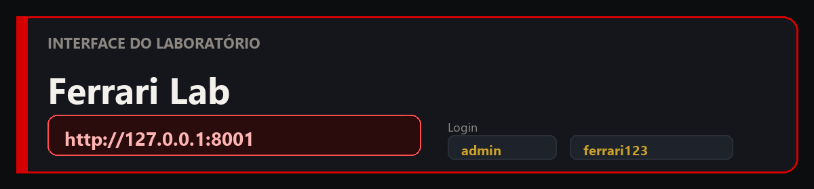
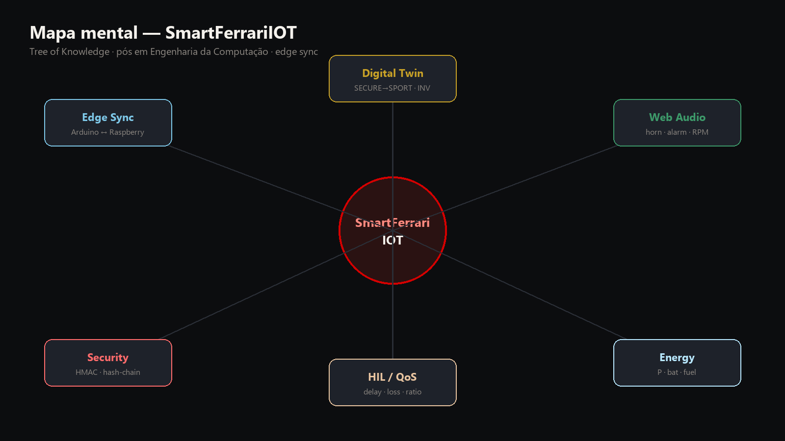
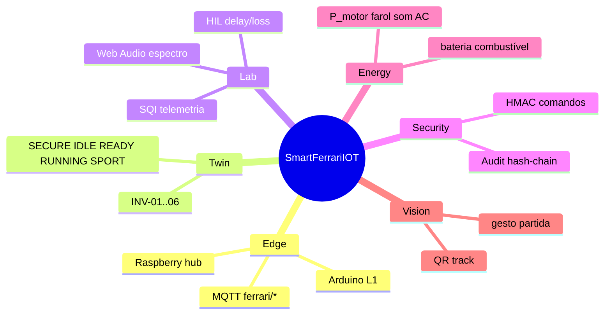
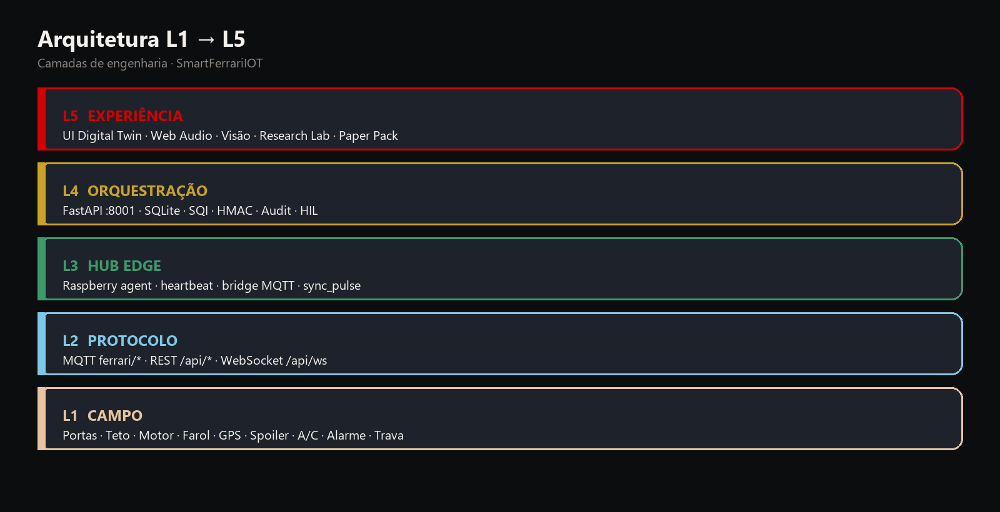
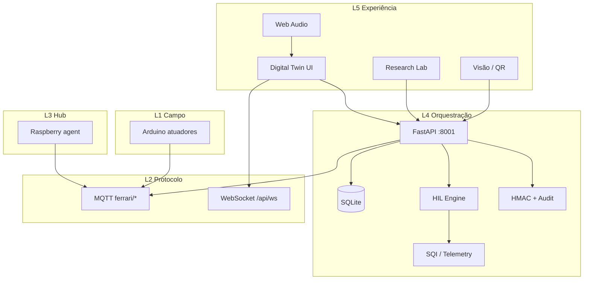
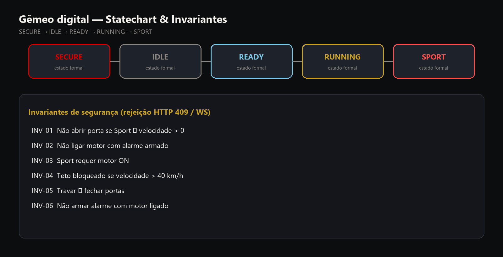
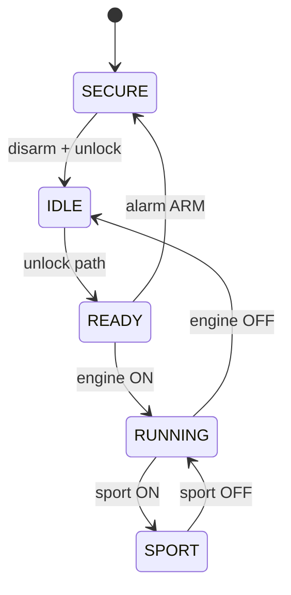
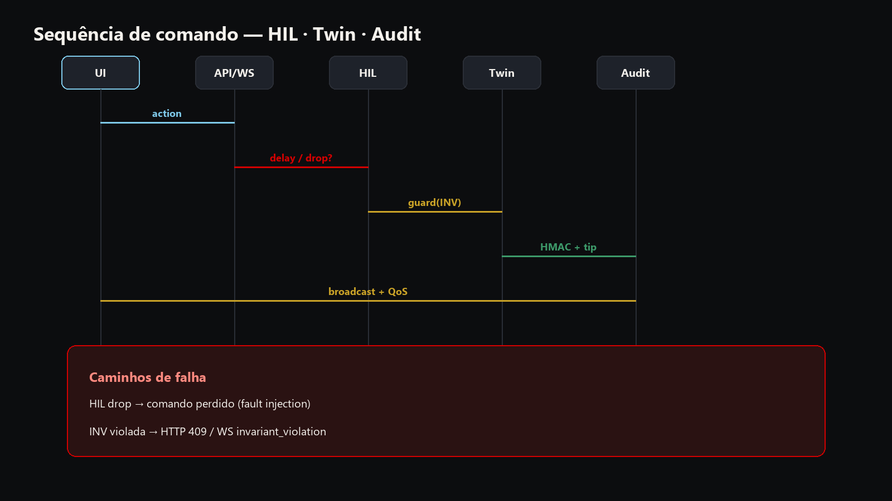
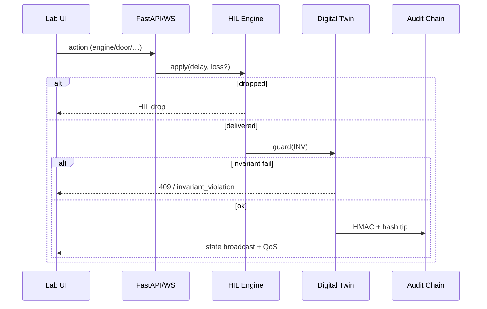
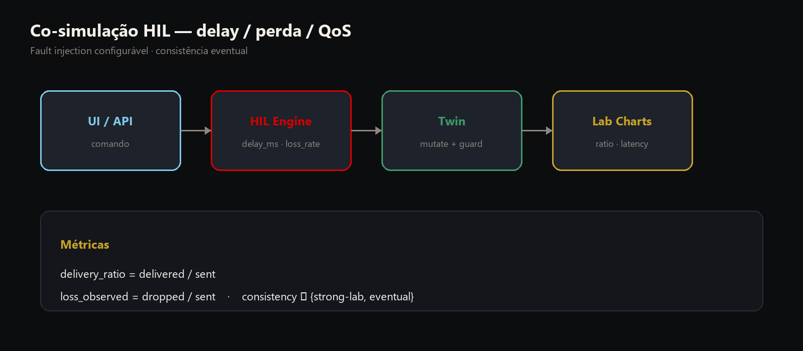

<div align="center">

# SmartFerrariIOT

**Plataforma experimental de pós em Engenharia da Computação** · sincronização edge **Arduino ↔ Raspberry Pi** · gêmeo digital formal · HIL/QoS · Web Audio · Research Lab · Ferrari SF90 lab unit

<br/>

<a href="http://127.0.0.1:8001">
  
</a>

<br/>

<a href="http://127.0.0.1:8001"></a>


---

## Interface do Laboratório (análise / defesa)

**Clique no botão** para abrir a interface local usada na análise e na defesa.

<a href="http://127.0.0.1:8001">
  
</a>

| | |
|:---:|:---:|
| **URL** | **http://127.0.0.1:8001** |
| **Login** | `admin` |
| **Senha** | `ferrari123` |
| **Porta** | `8001` (SmartHomeIOT = `8000`) |

```powershell
cd SmartFerrariIOT
.\start.ps1
```

| Recurso | URL |
|:---:|:---:|
| **UI Lab** | **http://127.0.0.1:8001** |
| Health | http://127.0.0.1:8001/health |
| OpenAPI | http://127.0.0.1:8001/docs |
| Research overview | http://127.0.0.1:8001/api/research/overview |
| Paper Pack LaTeX | http://127.0.0.1:8001/api/research/paper-pack.tex |


<em>Referência SF90 · o Lab opera o gêmeo digital animável (portas, rodas, Sport, A/C, HIL, áudio).</em>

---

## Mapa mental do projeto



</div>



<div align="center">

---

## Arquitetura em camadas (L1–L5)



</div>



<div align="center">

**Documentação:** [ARCHITECTURE](docs/ARCHITECTURE.md) · [PROTOCOL](docs/PROTOCOL.md) · [METHODOLOGY](docs/METHODOLOGY.md)

---

## Gêmeo digital formal (UML / Statechart)



</div>



<div align="center">

| ID | Regra |
|:---:|:---:|
| INV-01 | Não abrir porta se Sport ∧ velocidade > 0 |
| INV-02 | Não ligar motor com alarme armado |
| INV-03 | Sport requer motor ON |
| INV-04 | Teto bloqueado se velocidade > 40 km/h |
| INV-05 | Travar ⇒ fechar portas |
| INV-06 | Não armar alarme com motor ligado |

Violação → **HTTP 409** ou evento WS `invariant_violation`

---

## Fluxo de comando (HIL + Twin + Audit)



</div>



<div align="center">



---

## Modelo energético (documentado)

$$
P_{total} = P_{motor}(rpm) + P_{farol} + P_{som} + P_{AC} + P_{track} + P_{spoiler}
$$

$$
P_{motor} = P_0 + k_{rpm}\cdot rpm \quad (+35\%\ \text{em Sport})
$$

$$
\Delta E_{bat}\ (Wh) \approx -P_{total}\cdot \Delta t_h, \quad
\Delta fuel \approx -\alpha\cdot P_{motor}\cdot \Delta t_h
$$

Constantes de bancada em `python_server/energy.py` · \(C_{bat}\approx 720\,Wh\)

---

## Research Lab — demonstração na banca

1. **Áudio real** — motor (ronco + rodas), buzina, alarme + espectro  
2. **Invariantes** — armar alarme → tentar motor → `INV-02`  
3. **HIL** — delay 80 ms / loss 20% → gráfico QoS  
4. **Portas** — Abrir Ambas · Travar/Destravar  
5. **Paper Pack** — export LaTeX

---

## Árvore do repositório

```text
SmartFerrariIOT/
├── start.ps1
├── web/
├── python_server/
├── arduino/
├── raspberry/
├── docs/assets/
├── experiments/exports/
└── tests/
```

---

## API rápida

| Método | Endpoint | Função |
|:---:|:---:|:---:|
| POST | `/api/auth/login` | Token |
| GET | `/api/status` | Snapshot |
| POST | `/api/door\|engine\|alarm\|…` | Atuadores |
| WS | `/api/ws` | Estado ao vivo |
| POST | `/api/research/hil` | HIL |
| POST | `/api/research/paper-pack` | LaTeX |
| GET | `/api/research/audit` | Hash-chain |

---

<a href="http://127.0.0.1:8001">
  
</a>

### [http://127.0.0.1:8001](http://127.0.0.1:8001)

</div>
